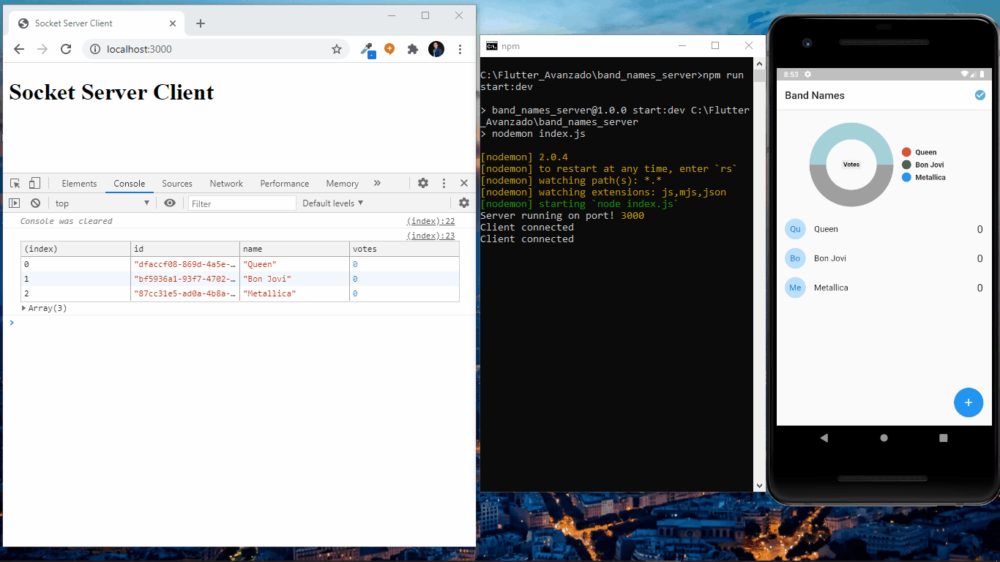

# Flutter App With Socket Server

[](https://pub.dartlang.org/packages/keyboard_actions)

The purpose of this apps is implement:
- Provider
- Socket IO Client
- Pie Chart

## Demo



## Getting started

You should ensure that you add the dependency in your flutter project.
```yaml
dependencies:
  socket_io_client: ^0.9.11
  provider: ^4.3.2+2
  pie_chart: ^4.0.1
```

You should then run `flutter packages upgrade` or update your packages in IntelliJ.

